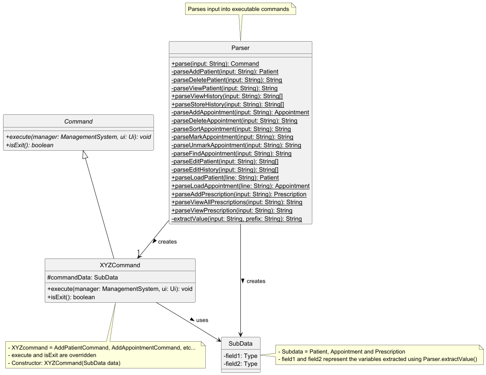
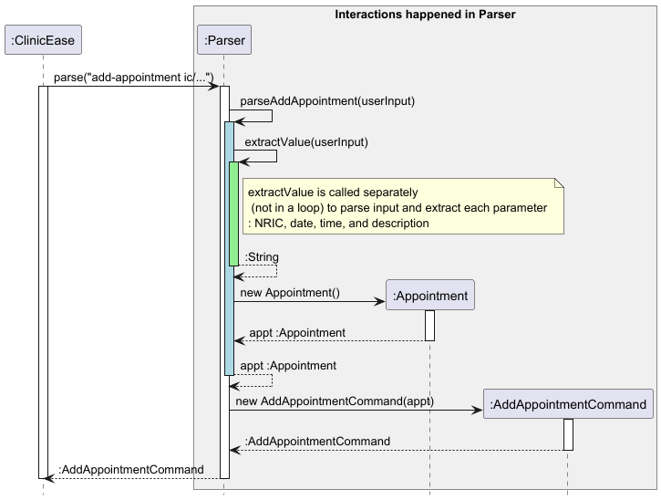

# Wen Yee's Project Portfolio Page

## Project: ClinicEase

**ClinicEase** is a CLI-based clinic management program that helps doctors - our target users - to efficiently manage patient records, 
medical histories, and appointments. The system enables user to view and update patient details, 
manage appointments, maintain medical history records, and manage prescriptions.  
This project aims to simplify clinic administrative tasks with a user-friendly interface.

## Summary of Contributions
Code Dashboard Link: [Wen Yee's Code Dashboard](https://nus-cs2113-ay2425s2.github.io/tp-dashboard/?search=chwenyee&breakdown=true&sort=groupTitle%20dsc&sortWithin=title&since=2025-02-21&timeframe=commit&mergegroup=&groupSelect=groupByRepos&checkedFileTypes=docs~functional-code~test-code~other)
 
### Enhancement Implemented

1. Reformat the UI output to ensure a consistent and aligned display format across the program.
2. Introduced custom exceptions e.g. `DuplicatePatientIDException`, `UnknownCommandException` and `InvalidInputFormatException` 
in v1.0 to enable more graceful error handling.
3. Improved the logic of `Parser.extractValue()` to correctly extract user input parameters, especially when both `dt/` and `t/`
are present.
4. Restructured the code in `ClinicEase.java` and `Parser.java`, and created a `command` package to make the codebase more OOP after v1.0.
5. Linked `Appointment` Class to `Patient` Class to ensure appointments stored in a `Patient` object are kept in sync 
with the appointment list in `ManagementSystem`.
6. Changed the data type of `dateTime` variable in `Appointment` to be `LocalDateTime` for better input validation of 
`dt/` and `t/`, and to simplify the implementation of the `sort-appointment` feature.
7. Added comprehensive validation for: NRIC format compliance, appointment scheduling conflicts (throws `AppointmentClashException`) 
and future-dated appointments (prevents past-date/time entries)
8. Implemented cleanup of associated appointment records when the patient is deleted.
9. Added JavaDoc for files such as AddAppointmentCommand, DeleteAppointmentCommand, ListAppointmentCommand, SortAppointmentCommand,
Appointment, ExitCommand, HelpCommand, and Parser. 

#### Features Implemented
1. **add-appointment**: Adds a new appointment to the list of appointment.

2. **delete-appointment**: Deletes a specified appointment from the appointment list.

3. **sort-appointment**: Sorts the appointments in the appointment list and display the sorted list to the user. Sorting
   can be performed by either `byDate` or `byId`.

4. **help**: Simple command that outputs all available command inputs of the application. 

#### Contributions to the UG:

**Sections:** 

- **Table of Content**
- **Quick Start**

- **Features:**

   - NOTE: Explains how to interpret command syntax, parameters, optional fields, input order, and case sensitivity.
   - `help`
   - `add-appointments`
   - `delete-appointments`
   - `sort-appointments`
   - `bye`
   
   I wrote the description, command input formats, and examples of usage for these features, providing the important things to note for 
parameters such as `NRIC`, `DATE`, `TIME`, and `APPOINTMENT_ID`.

- **FAQ**: I wrote the FAQ section, covering how data is saved, how to transfer data, and the risks of editing data files directly.

- **Known Issues**: I authored the command-parameter parsing issue, explaining the cause, impact, and current resolution of the problem when users omit spaces between command words and parameters.

- **Command Summary**: I wrote the Command Summary table, ensuring each command's format and example of usage are clearly presented for users' quick reference.

#### Contributions to the DG:

**Sections:**
- **Table of content**

- **Design: Parser component**
  - Documented the `Parser` class and its interaction with `Command` subclasses
  - Created:
    - Class diagram `parserClassDiagram.png`, showing the structure
    - Sequence diagram `parserSequence.png`, showing the parsing flow
  - Explained the parsing workflow in `Parser` 

- **Add and Delete Appointment feature:**

  - Documented the implementation details of the `add-appointment` and `delete-appointment` features, 
    including step-by-step usage scenarios to clarify system behavior.
  - Created sequence diagrams to visualize how the command interacts with the `Parser`, `ManagementSystem`, and `Storage` components.
    - `addAppointmentSequence.png` for `add-appointment`
    - `deleteAppointmentSequence.png` for `delete-appointment`
  - Explained the reason they are implemented this way
  - Explained the alternatives considered and justified their rejection

- Non-functional requirements

- Glossary 

#### Contributions to team-based tasks:

- Setting up the Github team repo
- Maintaining the issue tracker e.g. issue and milestones
- Release management e.g. wrapping up milestones, saving DG and UG as PDFs

#### Review/mentoring contributions:

- Helped teammates resolve Git merge conflicts and guided them on pull request practices.
- Reminding teammates of important deadlines.
- Helped to test out the newly-implemented features to ensure the feature works as desired.
- Discussed with teammates on what to include for Design and Implementation section in Developer Guide.
- Helped review the coding style consistency 

#### Contributions to the Developer Guide 

**Diagrams I contributed:**

Parser Class Diagram:

Parser Sequence Diagram:

Add Appointment Sequence Diagram:

Delete Appointment Sequence Diagram:

